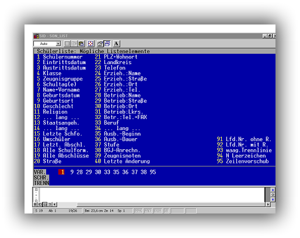
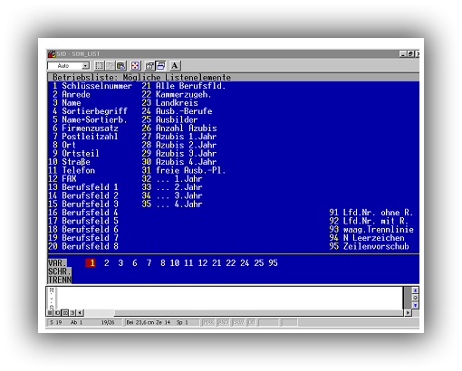

# BUSS
Für den Import der Daten aus dem Schulverwaltungsprogramm BUSS greift der Datenbank-Assistent auf exportierte Dateien aus BUSS zurück. Das Ergebnis des Exports bilden fünf Textdateien, welche die Daten für Schüler, Lehrer und Betriebe enthalten.

## Schritt 1: Daten aus BUSS exportieren

Um die Daten aus BUSS in Magellan importieren zu können, müssen Sie zunächst einen Export der Daten vornehmen. Zunächst sollten Sie die Schülerdaten für die Dateien S.TXT und SCHUELER.TXT exportieren. Dazu gehen Sie wie folgt vor:

### Datei S.TXT erzeugen
1.	Wählen Sie im Menü Sonderfunktionen den Befehl SID -> Lernm.
2.	Geben Sie in der nachfolgenden Maske den Dateinamen S und das Trennzeichen , an.
3.	Wählen Sie dann die Klassen von A bis Z.
4.	Wählen Sie bei der Frage Welche Schüler? die Antwort Alle.
5.	Es wird die Datei S.TXT erzeugt

### Datei SCHUELER.TXT erzeugen
Diese Datei wird mit Hilfe von selbst definierten Listen erzeugt, die in die Datei SCHUELER.TXT ausgegeben werden.
1.	Wählen Sie im Menü Sonderfunktionen den Befehl Eig. Listen.
2.	Wählen Sie die Option Schüler.
3.	Wählen Sie Neueingabe.
4.	Definieren Sie nun den Listenaufbau gemäß der nachfolgenden Abbildung und speichern Sie die Definition unter einem Namen ab.
5.	Öffnen Sie im Menü Stammdaten den Menüpunkt Hilfsdateien.
6.	Wählen Sie die Option Schüler und dann Drucken.
7.	Wählen Sie die Option Eigene Listen, definierte Listen und die Ausgabe in eine ASCII-Datei. 

8.	Geben Sie als Dateiname SCHUELER.TXT und als Trennzeichen , an.
9.	Es wird die Datei SCHUELER.TXT erzeugt.
Die Betriebedatei BETRIEB.TXT erzeugen Sie ebenfalls über eigene Listen

### Datei BETRIEB.TXT erzeugen
1.	Wählen Sie im Menü Sonderfunktionen den Befehl Eig. Listen.
2.	Wählen Sie die Option Betriebe.
3.	Wählen Sie Neueingabe.
4.	Definieren Sie nun den Listenaufbau gemäß der nachfolgenden Abbildung und speichern Sie die Definition unter einem Namen ab.

5.	Öffnen Sie im Menü Stammdaten den Menüpunkt Hilfsdateien.
6.	Wählen Sie die Option Betriebe und dann Drucken.
7.	Wählen Sie die Option Eigene Listen, definierte Listen und die Ausgabe in eine ASCII-Datei.
8.	Geben Sie als Dateiname BETRIEB.TXT und als Trennzeichen , an.
9.	Es wird die Datei BETRIEB.TXT erzeugt.
Über die Schnittstelle zur Landesstatistik erzeugen Sie nun die übrigen Dateien SCHUELER.SIL und LEHRER.LV.

### Dateien SCHUELER.SIL und LEHRER.LV erzeugen
1.	Wählen Sie im Menü Statistik den Menüpunkt Nds. Landesst.
2.	Wählen Sie die Option Daten ausgeben.
3.	Wählen Sie die Option Schuelerdaten (für *.SIL-Datei) bzw. Lehrkräfte (für *.LV-Datei)
4.	Es werden die Dateien erzeugt, welche die Endungen *.SIL bzw. *.LV besitzen.
5.	Führen Sie zwei Umbenennung durch: Datei mit der Endung SIL in die Datei SCHUELER.SIL und Datei mit der Endung LV in die datei LEHRER.LV umbenennen.

## Schritt 2: Installation einer leeren Datenbank

Bevor Sie eine leere Datenbank erzeugen, müssen Sie das Programm MAGELLAN installiert haben. Anschließend erzeugen Sie eine leere Datenbank inkl. Schlüsseltabellen wie folgt:
1.	Rufen Sie den MAGELLAN-Administrator auf.
2.	Wählen Sie Ansicht und dann Datenbankpflege. Wählen Sie die Option Datenbankinhalte löschen.
3.	Klicken Sie auf OK, um mit dem Erzeugen einer neuen Datenbank zu beginnen. 

> #### danger::Achtung!
>
> Ihre bisherige Datenbank wird dabei gelöscht! Über die Optionen können Sie angeben, ob Sie die Schlüsselverzeichnisse bzw. Postleitzahlen beibehalten wollen.

## Schritt 3: Mandanten und Zeitraum in Magellan anlegen

In der neu erzeugten MAGELLAN-Datenbank muss mindestens ein Zeitraum und ein Mandant eingetragen werden. Die aktuellen Schülerdaten aus BUSS werden in MAGELLAN zeitraum- und mandantenbezogen abgelegt. Dementsprechend muss beim Import festgelegt werden, zu welchem Zeitraum  und zu welchem Mandanten die Daten zugeordnet werden. Sinnvollerweise sollten in MAGELLAN je ein Zeitraum für das 1. und das 2. Halbjahr des aktuellen Schuljahres eingetragen werden. Zum Eintragen eines Zeitraums und eines Mandanten in MAGELLAN gehen Sie wie folgt vor.
1.	Rufen Sie MAGELLAN auf.
2.	Rufen Sie das Menü Verzeichnisse und dann den Menüpunkt Zeiträume auf.
3.	Fügen Sie im Dialogfenster Verzeichnis der Zeiträume die gewünschten Zeiträume ein.
4.	Tragen Sie unter Ansicht und dann Mandanten einen Mandanten ein. Die ist im Regelfall Ihre eigene Schule.
5.	Verlassen Sie MAGELLAN.

## Schritt 4: Statistikschlüssel und Postleitzahlen importieren

Nachdem eine neue leere Datenbank erzeugt worden ist, müssen Sie die Statistikschlüssel und die Postleitzahlen importieren, wenn Sie diese vor dem Löschen der Datenbank in Schritt 1 nicht beibehalten haben. Zum Import der Schlüssel und der Postleitzahlen gehen Sie wie folgt vor:
1.	Wählen Sie dazu Ansicht und dann Datenimporte. 
2.	Wählen Sie die Option Schlüsselverzeichnisse importieren.
3.	Wählen Sie anschließend die Option Postleitzahlverzeichnis importieren.

## Schritt 5: BUSS-Schlüssel an MAGELLAN-Schlüsselverzeichnisse anpassen

Zum Statistikabgleich erfolgt in BUSS die Zuordnung der verwendeten Bezeichner zu den Statistikschlüsseln über das BADEMS-Programm. 

>Schlüssel: 
Die Schlüssel im BADEMS-Programm müssen dabei den Schlüsselverzeichnissen in MAGELLAN entsprechen! Nur bei einer Übereinstimmung der jeweiligen Schlüssel können die Daten aus BUSS korrekt in MAGELLAN eingelesen werden.

## Schritt 6: BUSS-Daten importieren

Sie haben nun alle Voraussetzungen für den Import erfüllt und können mit dem eigentlichen Import der BUSS-Daten beginnen. Gehen Sie dazu wie folgt vor:

1.	Rufen Sie den MAGELLAN-Administrator auf.
2.	Wählen Sie Ansicht und dann Datenimporte. Wählen Sie die Option Daten aus Verwaltungsprogrammen importieren. Wählen Sie dabei im Auswahlfeld die Option BUSS (Niedersachsen) und klicken Sie dann auf Start.
3.	Geben Sie im Dialogfenster Importiere BUSS den Ordner der BUSS-Daten an, die Sie in Schritt 1 erzeugt haben. Wählen Sie einen Zeitraum, denen die aktuellen BUSS-Daten zugeordnet werden sollen (z.B. "1. Halbjahr 02/03" oder "2. Halbjahr 02/03"). Zusätzlich müssen Sie auch den Mandanten festlegen. Klicken Sie dann auf OK.
4.	Der Import kann je nach Hardwarekonfiguration und Umfang Ihrer BUSS-Daten mehrere Minuten dauern. Nach Abschluss des Imports können Sie den MAGELLAN-Administrator wieder verlassen.
