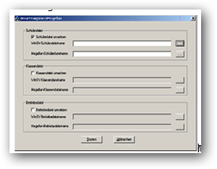
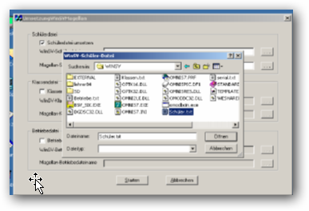
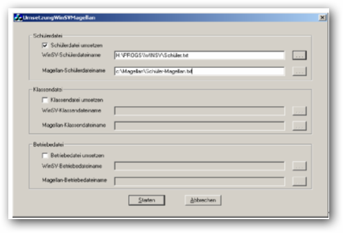

# WinSV

Die nachfolgenden Schritte beschreiben die Vorgehensweise für den Datenimport aus dem Schulverwaltungsprogramm WinSV in Bayern nach MAGELLAN. 

Der Import erfolgt in drei Schritten:

> #### primary::Hinweis
>
>  Das Konvertierprogramm für die aus WinSV erzeugten Textdateien in das MAGELLAN-Importformat wurde freundlicherweise von der Berufsschule Lichtenfels durch Herrn Gauglitz zur Verfügung gestellt. Es wird im Rahmen der MAGELLAN-Installation mit installiert. Für dieses Programm übernimmt STÜBER SYSTEMS keinen Support. Bei Rückfragen wenden Sie sich bitte direkt an die Berufsschule in Lichtenfels.

## Schritt 1: Export der Daten aus WinSV

Zum Export der Daten gehen Sie in WinSV wie folgt vor:

1.	Rufen Sie WinSV auf und versichern Sie sich, dass Sie sich im Einzelplatzmodus befinden.

2.	Wählen Sie das ```Pflegemenü``` aus und rufen Sie dort das Dienstprogramme-Menü auf.

3.	Unter ```Dienstprogramme``` wählen Sie den ```Datenexport```…

4.	Für das Datenformat wählen Sie ```Delimited (tabs)``` und unter Datenexport den Punkt ```Felder von Dateiformat``` laden aus. 

5.	Für den Export der Schülerdatei wählen Sie ```DSchueler``` aus und bestätigen dies mit ```OK```. Anschließend starten Sie den Export mit dem Button ```Start```. 

6.	Wählen Sie ein Verzeichnis und geben Sie einen Namen für die Exportdatei an. 

7.	Gehen Sie für die Klassen- und Betriebedaten analog vor.

> #### success::Tipp
>
> Daten mehrerer Schulen: Wenn die aus WinSV exportierten Dateien Daten mehrerer Schulen enthalten, müssen Sie die Schüler und Klassen, die nicht in MAGELLAN importiert werden sollen, herauslöschen. Die Staatliche Berufsschule Lichtenfels wird voraussichtlich das Umsetzprogramm erweitern, so dass dort die Daten für jede Schule selektiert werden können.

## Schritt 2: Konvertieren der Exportdatei in das MAGELLAN-Importformat

Die aus WinSV exportierten Dateien müssen jetzt in das MAGELLAN-Importformat für Schüler-, Klassen- und Betriebedaten gebracht werden. Dies erfolgt mit dem Programm UmsetzungWinSVMagellan der Berufsschule Lichtenfels.

1.	Starten Sie das Umsetzungsprogramm über den Explorer. Rufen Sie dazu die Datei UmsetzungWinSVMagellan.exe im Programmordner von MAGELLAN (z.B. C:\Stueber Software\Magellan 5\UmsetzungWinSVMagellan.exe). Nach dem Aufruf des Programms sehen Sie folgendes Fenster: 
   
    

2.	Suchen Sie die Exportdatei von WinSV, wählen Sie den Pfad und geben Sie einen Namen für die zu erzeugende MAGELLAN-Importdatei an. 
   
   
 

3.	Dies können Sie für die Schüler-, Klassen- und Betriebedatei gleichzeitig durchführen.
   
   
 
## Schritt 3: Daten nach MAGELLAN importieren

Die im 2. Schritt erzeugten Dateien für Schüler, Klassen und Betriebe entsprechen jetzt dem MAGELLAN-Importformat für Schüler-, Klassen- bzw. Betriebedaten. Diese Dateien müssen Sie jetzt über den Magellan-Administrator nach MAGELLAN importieren. Wie Sie dazu vorgehen müssen, erfahren Sie im Kapitel MAGELLAN-Importformat.
